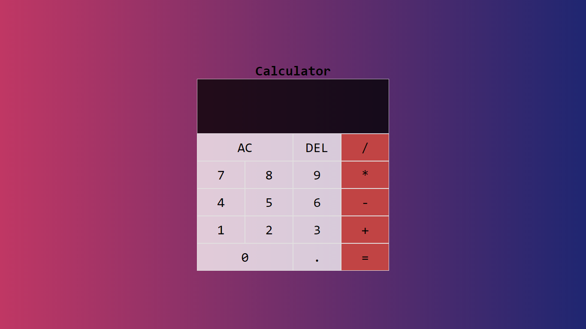

# Calcultor

> This is a basic calculator made using HTML, CSS and javascript
You can view the project from here: https://lakshdhamija.github.io/calculator/

---

### Table of Contents

- [Description](#description)
- [How To Use](#how-to-use)
- [References](#references)
- [License](#license)
- [Author Info](#author-info)

---

## Description

This is a basic calculator made using HTML, CSS and javascript. This is my first javascript project. It is fully responsive.

#### Technologies

- HTML
- CSS
- Javascript

[Back To The Top](#read-me-template)

---

## Author Info

- LinkedIn - [@lakshDhamija](https://linkedin.com/in/laksh-dhamija)

[Back To The Top](#read-me-template)
